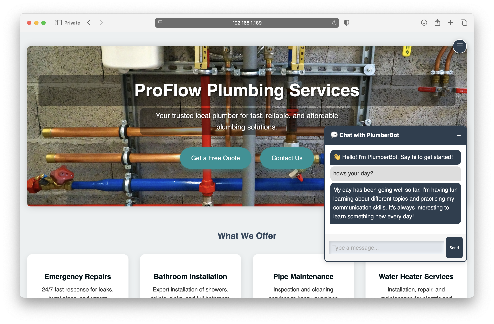

# 🤖 AI-Enhanced ChatBot

A containerized full-stack chatbot application powered by **Docker**, built for seamless integration into any website. 
Designed with scalability in mind, it connects a lightweight front-end to a Python back-end and an **Ollama** LLM server. 
Perfect for embedding a responsive, smart chat assistant into existing websites — hosted on a Raspberry Pi or any 
Docker-compatible environment.

Future updates will include **RAG (Retrieval-Augmented Generation)** capabilities, 
allowing the chatbot to serve domain-specific answers from uploaded documents or manuals.

---

<div style="display: flex; justify-content: center; align-items: center;">
    
</div>

---

## 🌐 Frontend

| Feature              | Description                                 |
|----------------------|---------------------------------------------|
| `index.html`         | Chat UI, can be embedded into any website   |
| `style.css`          | Handles layout and responsiveness           |
| `script.js`          | Sends/receives chat messages via AJAX       |

- Works standalone (basic responses) or connected to the Flask API.
- Built for ease of customization — simply copy to your website.


---

## 🧠 Backend Architecture

This project uses a containerized microservice-style setup with clear separation between the chatbot frontend and the LLM engine.

### 🔧 Components

| Component  | Role                                                                 |
|------------|----------------------------------------------------------------------|
| `chatbot`  | Web interface container that serves the frontend and proxies chat requests to the LLM backend |
| `llama`    | LLM backend container running Ollama, exposing models on port `11434` |

- The **`chatbot` container** runs a web app (currently static HTML + JavaScript) and connects to the **Ollama API** in the `llama` container.
- Apache2 is configured with a custom `httpd.conf` to handle proxy routing.
---

## 🧪 LLM Integration with Ollama

| Component    | Port   | Description                                |
|--------------|--------|--------------------------------------------|
| Ollama API   | `11434`| Local LLM model server (e.g., `tinyllama`) |

- Supports pulling and running open LLMs like `tinyllama`, `mistral`, and others via [Ollama](https://ollama.com).
- Models are downloaded once and stored in a Docker volume (`ollama_models`).
- You can interact with the LLM via simple HTTP requests to `http://localhost:11434/api/chat`.


---

## 🐳 Docker Setup

[docker-compose.yml](docker-compose.yml)


---

### 🚀 Getting Started

```bash
git clone https://github.com/Janos11/chatBot.git
cd open-webui
docker compose up -d
```

Build and run with Docker Compose:

```bash
docker compose up --build
```

Access the chat interface in your browser:
Then open your browser: 👉 `http://localhost:85` or `http://<your-pi-ip>:85`


---
### 🧾 Technologies Used

| Technology       | Purpose                                | Link |
|------------------|----------------------------------------|------|
| Docker          | Containerization                      | [docker.com](https://www.docker.com) |
| Flask           | Lightweight backend API               | [Flask](https://flask.palletsprojects.com) |
| Ollama          | LLM API and model hosting             | [ollama.com](https://ollama.com) |
| Apache2         | Web server and reverse proxy          | [httpd.apache.org](https://httpd.apache.org) |
| HTML/CSS/JS     | Frontend interface                    | - |
| Raspberry Pi    | Target embedded deployment platform   | [raspberrypi.com](https://www.raspberrypi.com) |

## 📌 Documentation

| Section                         | Status                                                                                                 |
|---------------------------------|--------------------------------------------------------------------------------------------------------|
| 🔧 Resolving CORS issue         | [resolving_cors_issue_ollama_api_integration.md](documents/resolving_cors_issue_ollama_api_integration.md)                                                                                           |
| 📚 How to Add Documents for RAG | Coming soon                                                                                            |
| 🧪 Testing Instructions         | Coming soon                                                                                            |
| ✅ Full Stack Summary            | Coming soon                                                                                            |
| 🗂️ Git Commands                | [git\_cheat\_sheet.md](https://github.com/Janos11/Robot_Web_Controller/blob/master/git_cheat_sheet.md) |
| 🦙 Ollama Commands              | [ollama_commands.md](https://github.com/Janos11/Local-LLM-Backend-Container/blob/main/notebooks/ollama_commands_cheat_sheet.md)


## ✅ Full Stack Summary

This project qualifies as a full-stack chatbot system:

| Component       | Technology/Description                     |
|-----------------|--------------------------------------------|
| **Frontend**    | Interactive, embeddable UI (HTML/CSS/JS)   |
| **Backend**     | Flask + CGI logic                          |
| **AI Layer**    | Local LLM via Ollama                       |
| **Deployment**  | Docker Compose orchestration               |
| **Hosting**     | Raspberry Pi or cloud VPS                  |

---
## 🤝 Contributors

<table style="font-family: Arial, sans-serif; line-height: 1.6;">
  <tr>
    <td><strong>János Rostás</strong></td>
    <td>
      👨‍💻 Electronic & Computer Engineer<br>
      🧠 Passionate about AI, LLMs, and RAG systems<br>
      🐳 Docker & Linux Power User<br>
      🔧 Raspberry Pi Builder | Automation Fanatic<br>
      💻 Git & GitHub DevOps Explorer<br>
      📦 Loves tinkering with Ollama, containerized models, and APIs<br>
      🌐 <a href="https://janosrostas.co.uk" target="_blank">janosrostas.co.uk</a><br>
      🔗 <a href="https://www.linkedin.com/in/janos-rostas/" target="_blank">LinkedIn</a><br>
      🐙 <a href="https://github.com/Janos11" target="_blank">GitHub</a> |
      🐋 <a href="https://hub.docker.com/u/janos11" target="_blank">Docker Hub</a>
    </td>
  </tr>
  <tr>
    <td><strong>ChatGPT</strong></td>
    <td>
      🤖 AI Pair Programmer by OpenAI<br>
      💡 Supports brainstorming, prototyping, and debugging<br>
      📚 Backed by years of programming knowledge and best practices
    </td>
  </tr>
  <tr>
    <td><strong>Grok</strong></td>
    <td>
      🤖 AI Assistant by xAI<br>
      🚀 Accelerates human scientific discovery<br>
      💬 Provides helpful and truthful answers<br>
      🌐 Accessible on <a href="https://grok.com" target="_blank">grok.com</a> and X platforms
    </td>
  </tr>
</table>