# Plan: Upgrade PlumberBot to LLM-Powered Chatbot

## Objective
Fork the current rule-based PlumberBot repo and integrate an LLM (using Ollama) to handle user conversations more intelligently.

---

## Step-by-Step Plan


### 1. Teast the backend in terminal

```bash
curl http://localhost:11434/api/generate \
  -d '{
    "model": "tinyllama",
    "prompt": "What is Docker?"
  }'
```
🔁 Replace "llama3" with the actual model you've pulled (like "mistral" or "llama2"), if different.

If you'd prefer a full answer all at once in your script, you can set:
```bash
curl http://localhost:11434/api/generate \
  -d '{
    "model": "tinyllama3",
    "prompt": "What is Docker?",
    "stream": false
  }'
```


### 2. Set up proxy to avoid browser CROSS


### (Optional) Add More Intelligence
- Implement prompt templates.
- Add memory or context management.
- Integrate external tools (calendar booking, FAQs, etc).

---

## Outcome
You’ll have a smarter PlumberBot that understands user queries using LLMs and still sends structured data to your backend for processing.

## Architecture

```mermaid
flowchart TD
  subgraph Users
    Web[Web Users]
    Devs[Developers]
    Ops[Operations]
  end

  subgraph "Kubernetes Cluster"
    
    subgraph "Namespace: bionic-gpt"
      Nginx[Nginx]
      OAuth[oauth2-proxy]
      Server["Bionic Server<br><hr>• Limits Management<br>• Model Management<br>• MCP Server Management"]
      Chunking[Chunking Engine]
      ObjectStore[Object Storage]
      DB[(PostgreSQL with Column Encryption and Vector DB)]
      Grafana[Grafana]
    end

    subgraph "Namespace: model-garden"
      MG["
• LLaMA 3
• Embeddings Model
• External Model API
"]
    end

    subgraph "Namespace: mcp-servers"
      MCP["
• RAG Engine
• Time Service
"]
    end

  end

  Web --> Nginx
  Devs --> Nginx
  Ops --> Grafana

  Nginx --> OAuth
  OAuth --> IdP[External Identity Provider]
  OAuth --> Server

  Server --> DB
  Grafana --> DB

  Server --> MG
  Server --> MCP
  Server --> Chunking
  Server --> ObjectStore

  Server --> Secrets[HSM via K8s Secrets]

  %% Notes
  Note1[/"MinIO or S3-compatible storage"/]
  Note2[/"Chunking engine handles document preprocessing"/]
  Note3[/"Vibe Coding"/]

  ObjectStore -.-> Note1
  Chunking -.-> Note2
  Devs -.-> Note3
```


