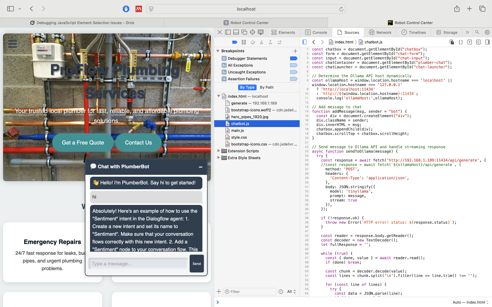
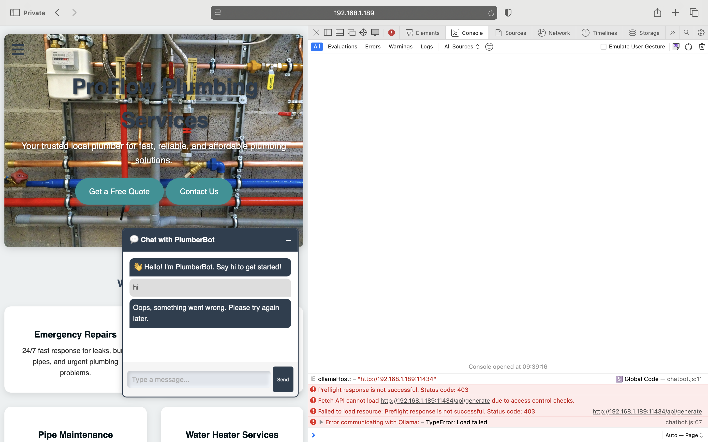

# Resolving CORS Issue for Ollama API Integration

## Overview
This document details the CORS (Cross-Origin Resource Sharing) issue encountered when integrating a JavaScript-based chat interface with an Ollama API running on a Raspberry Pi, and provides a step-by-step solution using an Apache reverse proxy to bypass CORS.

<div style="display: flex; justify-content: space-between;">
    
    
</div>

### Environment
- **Web Server**: Apache running in a Docker container, exposed on `http://192.168.1.189:85`.
- **Ollama API**: Running in a Docker container, exposed on `http://192.168.1.189:11434`.
- **Flask Backend**: Running on `http://192.168.1.189:5001`, reserved for handling customer information from a previous rule-based chat implementation.
- **Client Access**: Webpage accessed from local (Raspberry Pi, `http://localhost:85`) and remote devices (e.g., MacBook, `http://192.168.1.189:85`).
- **Issue**: Browser throws a CORS error when JavaScript tries to fetch from `http://192.168.1.189:11434/api/generate`:
  ```bash
  [Error] Preflight response is not successful. Status code: 403
  [Error] Fetch API cannot load http://192.168.1.189:11434/api/generate due to access control checks.
  [Error] Failed to load resource: Preflight response is not successful. Status code: 403
  [Error] Error communicating with Ollama: – TypeError: Load failed
  ```

## Understanding CORS

### What is CORS?
- CORS is a browser security mechanism that restricts how web pages from one origin (e.g., `http://192.168.1.189:85`) can request resources from another origin (e.g., `http://192.168.1.189:11434`).
- An **origin** is defined by protocol, hostname, and port. Different ports (`85` vs `11434`) make these distinct origins.
- The browser requires the server (Ollama) to include headers like `Access-Control-Allow-Origin` to permit cross-origin requests.

### What is a Preflight Request?
- A **preflight request** is an `OPTIONS` HTTP request sent by the browser before a complex request (e.g., `POST` with `Content-Type: application/json`).
- It asks the server: "Is `http://192.168.1.189:85` allowed to send a `POST` request with these headers?"
- The server must respond with:
  ```http
  Access-Control-Allow-Origin: http://192.168.1.189:85
  Access-Control-Allow-Methods: POST, OPTIONS
  Access-Control-Allow-Headers: Content-Type
  ```
- Ollama’s server does not include these headers, resulting in a 403 Forbidden response for the preflight request.

### Why It Happens
- The JavaScript (`chat.js`) runs on `http://192.168.1.189:85` and tries to fetch from `http://192.168.1.189:11434`.
- The browser detects the different ports, triggers a preflight request, and Ollama rejects it because it lacks CORS configuration.
- This only occurs in browsers; tools like `curl` bypass CORS, which is why your curl commands worked.

### Visual Analogy
Imagine the browser as a security guard:
- You (JavaScript on `http://192.168.1.189:85`) want to talk to a VIP (Ollama on `http://192.168.1.189:11434`).
- The guard sends a permission slip (`OPTIONS` request) to the VIP’s manager (Ollama server).
- If the manager doesn’t approve (no CORS headers or 403), the guard blocks you, and you get the error.

## Solution: Apache Reverse Proxy

### Why Use a Reverse Proxy?
- Directly configuring Ollama to support CORS requires modifying its source code, which is complex and may need container rebuilding.
- The existing Flask backend on port `5001` is reserved for customer data processing, so we avoid using it.
- An Apache reverse proxy routes requests from `http://192.168.1.189:85/api/ollama` to `http://ollama:11434/api/generate` within the Docker network.
- Since the proxy is on the same origin as the web server (`http://192.168.1.189:85`), the browser sees no cross-origin request, bypassing CORS.

### Steps to Implement

#### 1. Update Apache Configuration
Modify the Apache configuration (`httpd.conf`) to include a reverse proxy setup for the Ollama API.

- **Edit `httpd.conf`**:
  Ensure the following modules are enabled in `/usr/local/apache2/conf/httpd.conf`:
  ```apache
  LoadModule proxy_module modules/mod_proxy.so
  LoadModule proxy_http_module modules/mod_proxy_http.so
  ```
  Add the reverse proxy configuration at the end of `httpd.conf`:
- 
```apache
  <VirtualHost *:80>
    ServerName localhost
    DocumentRoot /usr/local/apache2/htdocs

    # Enable required modules
    LoadModule proxy_module modules/mod_proxy.so
    LoadModule proxy_http_module modules/mod_proxy_http.so
    LoadModule headers_module modules/mod_headers.so
    LoadModule rewrite_module modules/mod_rewrite.so

    # Reverse proxy for Ollama API
    <Location /api/ollama>
        ProxyPass http://192.168.1.189:11434/api/generate
        ProxyPassReverse http://192.168.1.189:11434/api/generate
        Header set Access-Control-Allow-Origin "*"
        Header set Access-Control-Allow-Methods "GET, POST, OPTIONS"
        Header set Access-Control-Allow-Headers "Content-Type"
        <If "%{REQUEST_METHOD} = 'OPTIONS'">
            SetEnvIf Request_Method OPTIONS return_204
            Header set Content-Length 0
            Header set Content-Type text/plain
            RewriteEngine On
            RewriteCond %{REQUEST_METHOD} =OPTIONS
            RewriteRule .* - [R=204,L]
        </If>
    </Location>
  </VirtualHost>

```
  
  - `ProxyPass` forwards requests from `http://192.168.1.189:85/api/ollama` to `http://ollama:11434/api/generate` within the Docker network.
  - `ProxyPassReverse` ensures response headers are rewritten correctly.
  - The `Header set` directives add CORS headers as a fallback, though they’re typically unnecessary since the proxy makes requests same-origin.

- **Update Docker Volume**:
  Ensure `./backend/httpd.conf` in your project directory is updated with the above configuration and mounted to `/usr/local/apache2/conf/httpd.conf` as per your Docker Compose setup.

- **Restart Apache**:
  ```bash
  docker restart chatBot
  ```

#### 2. Update JavaScript
The provided `chat.js` uses the relative path `/api/ollama` to send requests to the Apache proxy endpoint, ensuring same-origin requests. No changes are needed beyond the provided script.

#### 3. Test the Setup
- **Local Access**:
  - On the Raspberry Pi, access `http://localhost:85` and test the chat.
  - Verify requests to `http://localhost:85/api/ollama` reach Ollama via the proxy.
- **Remote Access**:
  - On your MacBook, access `http://192.168.1.189:85` and test the chat.
  - Check the browser console (DevTools) for errors.
- **Verify Proxy**:
  - Run `docker logs chatBot` to check Apache logs for proxy activity.
  - Test the endpoint directly:
    ```bash
    curl -X POST http://192.168.1.189:85/api/ollama -H "Content-Type: application/json" -d '{"model":"tinyllama","prompt":"how are you?"}'
    ```

#### 4. Troubleshooting
- **Proxy Not Working**:
  - Ensure `mod_proxy` and `mod_proxy_http` are enabled in Apache.
  - Verify the Docker network allows the `web_server` container to resolve `ollama:11434`:
    ```bash
    docker exec -it chatBot curl http://ollama:11434/api/generate
    ```
  - Check Apache error logs:
    ```bash
    docker exec chatBot cat /usr/local/apache2/logs/error_log
    ```
- **Ollama Not Responding**:
  - Confirm the Ollama container is running:
    ```bash
    docker ps
    ```
  - Test Ollama directly:
    ```bash
    curl http://192.168.1.189:11434/api/generate -X POST -H "Content-Type: application/json" -d '{"model":"tinyllama","prompt":"test"}'
    ```
- **Persistent CORS Errors**:
  - If CORS errors appear, ensure the proxy is correctly routing requests. The relative path (`/api/ollama`) should prevent CORS issues, but the `Header set` directives provide a fallback.

## Why This Works
- The reverse proxy makes the Ollama API appear as part of the same origin (`http://192.168.1.189:85/api/ollama`), so the browser doesn’t trigger a preflight request.
- The dynamic host logic in `chat.js` is replaced with a relative path, simplifying the setup.
- The existing Flask backend on port `5001` remains untouched for future customer info processing.
- No modifications to Ollama’s source code are needed, avoiding complex container rebuilds.

## Future Considerations
- **Security**: Restrict the proxy endpoint (`/api/ollama`) to specific IP ranges or add authentication if exposed publicly.
- **Scalability**: If you add more API endpoints, extend the `ProxyPass` rules in `httpd.conf`.
- **Flask Integration**: If you later want to use the Flask backend for additional features, you can add routes to handle both customer info and Ollama API requests.

## Conclusion
Using an Apache reverse proxy is a reliable way to bypass CORS without altering Ollama or repurposing the Flask backend. This solution ensures the chat interface works seamlessly for both local and remote clients, maintaining the existing Docker setup.


---
## 🤝 Contributors

<table style="font-family: Arial, sans-serif; line-height: 1.6;">
  <tr>
    <td><strong>János Rostás</strong></td>
    <td>
      👨‍💻 Electronic & Computer Engineer<br>
      🧠 Passionate about AI, LLMs, and RAG systems<br>
      🐳 Docker & Linux Power User<br>
      🔧 Raspberry Pi Builder | Automation Fanatic<br>
      💻 Git & GitHub DevOps Explorer<br>
      📦 Loves tinkering with Ollama, containerized models, and APIs<br>
      🌐 <a href="https://janosrostas.co.uk" target="_blank">janosrostas.co.uk</a><br>
      🔗 <a href="https://www.linkedin.com/in/janos-rostas/" target="_blank">LinkedIn</a><br>
      🐙 <a href="https://github.com/Janos11" target="_blank">GitHub</a> |
      🐋 <a href="https://hub.docker.com/u/janos11" target="_blank">Docker Hub</a>
    </td>
  </tr>
  <tr>
    <td><strong>ChatGPT</strong></td>
    <td>
      🤖 AI Pair Programmer by OpenAI<br>
      💡 Supports brainstorming, prototyping, and debugging<br>
      📚 Backed by years of programming knowledge and best practices
    </td>
  </tr>
  <tr>
    <td><strong>Grok</strong></td>
    <td>
      🤖 AI Assistant by xAI<br>
      🚀 Accelerates human scientific discovery<br>
      💬 Provides helpful and truthful answers<br>
      🌐 Accessible on <a href="https://grok.com" target="_blank">grok.com</a> and X platforms
    </td>
  </tr>
</table>